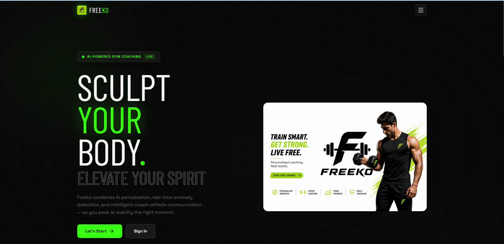

# Freeko — AI-Powered Gym Coaching Platform



> **Freeko** is a full-stack AI gym coaching platform that connects coaches and athletes through intelligent training plan generation, real-time anomaly detection, and automated weekly reporting — all powered by Google Gemini 2.0 Flash.

---

## Table of Contents

- [Overview](#overview)
- [Features](#features)
- [Tech Stack](#tech-stack)
- [Architecture](#architecture)
- [Project Structure](#project-structure)
- [Getting Started](#getting-started)
  - [Prerequisites](#prerequisites)
  - [Environment Variables](#environment-variables)
  - [Running Locally](#running-locally)
  - [Running with Docker](#running-with-docker)
- [AI Features](#ai-features)
- [API Reference](#api-reference)
- [Deployment](#deployment)
- [Contributing](#contributing)

---

## Overview

Freeko bridges the gap between coaches and athletes by automating the most time-consuming parts of coaching — plan generation, performance analysis, and weekly review — while keeping human coaching at the center through real-time chat and manual overrides.

**For coaches:**
- Generate complete 8–16 week periodized training programs in seconds using Gemini AI
- Monitor every athlete's performance through real-time anomaly detection
- Receive auto-generated weekly reports every Sunday summarizing sessions, chat, and AI flags
- Communicate with athletes in a real-time Socket.io chat with AI-powered session summaries

**For athletes:**
- Follow a structured AI-generated plan with daily session logging
- Get instant AI feedback after every workout (anomaly detection, RPE analysis)
- Track progress across lifts, volume, compliance, and streaks
- Message your coach directly with session context auto-attached

---

## Features

### Periodization Architect
Gemini AI generates a complete periodized training program tailored to the athlete's fitness level, goals, competition date, height, and weight. The plan is structured into mesocycles → microcycles → individual sessions, with progressive overload, deload weeks, and volume targets per muscle group baked in.

### Anomaly Detective (LangGraph Multi-Agent)
A two-agent LangGraph pipeline runs after every logged workout session:
- **Agent 1 (Data Collector)** reads the exercise comparison data (actual vs planned RPE, weight trend vs previous session, sets/reps vs plan)
- **Agent 2 (Reasoner)** applies threshold rules to flag anomalies like `lift_drop`, `high_rpe_trend`, `overtraining`, `skipped_sessions`, and more
- Results are saved to the session and surfaced immediately on the athlete's dashboard and in the coach's report

### Coach-Athlete Summarizer
A weekly cron job runs every Sunday at midnight and generates a structured `WeeklyReport` for each active plan by reading the week's sessions and chat messages, pre-aggregating the data, and calling Gemini to write concise summary bullets and an anomaly insight sentence.

### Real-Time Chat
Socket.io powers a full-featured coach-athlete messaging system with:
- Per-plan chat rooms (`join_plan_room`)
- Typing indicators with 1.5s debounce auto-stop
- Read receipts
- AI summary panel that pulls the latest weekly report inline

### Athlete Dashboard
A real-time dashboard showing:
- Active program progress bar and current mesocycle context
- This week's session strip (Mon–Sun) with completion status
- Today's session with exercise list, Start/Skip actions, and rest day detection
- Streak, compliance, and volume tracking per muscle group
- Anomaly alert cards from the latest AI report

---

## Tech Stack

| Layer | Technology |
|---|---|
| Frontend | React 18, Tailwind CSS, Framer Motion, Recharts, Socket.io-client |
| Backend | Node.js, Express, Socket.io, Mongoose, node-cron, ioredis |
| AI Service | Python 3.11, FastAPI, LangChain, LangGraph, Google Gemini 2.0 Flash |
| Database | MongoDB Atlas |
| Cache | Redis (Upstash) via ioredis |
| Auth | JWT (access + refresh tokens) |
| Containerization | Docker, Docker Compose |

---

## Architecture

```
┌─────────────────────────────────────────────────────────────────┐
│                        React Frontend                           │
│         (Vite + Tailwind + Framer Motion + Recharts)           │
└───────────────────────────┬─────────────────────────────────────┘
                            │ HTTP + Socket.io
                            ▼
┌─────────────────────────────────────────────────────────────────┐
│                    Node.js / Express                            │
│                  backend — port 5000                            │
│                                                                 │
│  ┌─────────────┐  ┌──────────────┐  ┌──────────────────────┐  │
│  │   REST API  │  │  Socket.io   │  │  node-cron (Sunday)  │  │
│  │  /api/...   │  │  chat rooms  │  │  weekly report job   │  │
│  └──────┬──────┘  └──────────────┘  └──────────────────────┘  │
│         │                                                       │
│  ┌──────▼──────┐  ┌──────────────┐                            │
│  │  MongoDB    │  │ Redis/Upstash│                            │
│  │   Atlas     │  │   (cache)    │                            │
│  └─────────────┘  └──────────────┘                            │
└───────────────────────────┬─────────────────────────────────────┘
                            │ HTTP (axios)
                            ▼
┌─────────────────────────────────────────────────────────────────┐
│                  FastAPI AI Service                             │
│               ai_services — port 8000                          │
│                                                                 │
│  ┌──────────────────┐  ┌──────────────┐  ┌─────────────────┐  │
│  │  /generate-plan  │  │/detect-anomaly│  │/summarize-week  │  │
│  │  Gemini 2.0 Flash│  │  LangGraph   │  │ Gemini 2.0 Flash│  │
│  │  Periodization   │  │  2-agent pipe│  │ Summary Chain   │  │
│  └──────────────────┘  └──────────────┘  └─────────────────┘  │
└─────────────────────────────────────────────────────────────────┘
```

---

## Project Structure

```
freeko/
├── frontend/                   # React + Vite app
│   ├── src/
│   │   ├── components/
│   │   │   ├── athlete/        # AthleteDashboard, AthleteWorkout, AthleteProgress, AthleteChat
│   │   │   ├── coach/          # CoachDashboard, CoachPlanBuilder, CoachReports, CoachChat
│   │   │   └── shared/         # Navbar, LandingPage
│   │   ├── store/              # Zustand auth + workout stores
│   │   └── lib/                # axios instance
│   └── package.json
│
├── backend/                    # Node.js + Express
│   ├── config/
│   │   ├── db.js               # MongoDB connection
│   │   └── redis.js            # ioredis client (Upstash)
│   ├── controllers/            # planController, workoutController, reportController, etc.
│   ├── middleware/             # auth (JWT), error handling
│   ├── models/                 # MasterPlan, Mesocycle, Microcycle, WorkoutSession, WeeklyReport, etc.
│   ├── routes/                 # Express routers
│   ├── sockets/                # Socket.io event handlers
│   ├── utils/
│   │   ├── cache.js            # cached(), invalidate(), TTL presets
│   │   └── cronJob.js          # Sunday weekly report cron
│   ├── server.js
│   └── Dockerfile
│
├── ai_services/                # Python FastAPI + LangChain
│   ├── agents/
│   │   └── anomaly_agents.py   # LangGraph 2-agent anomaly detection
│   ├── chains/
│   │   ├── periodization_chain.py   # Plan generation prompt + chain
│   │   └── summary_chain.py         # Weekly summary prompt + pre-aggregation
│   ├── routers/
│   │   ├── periodization_router.py
│   │   ├── anomaly_router.py
│   │   └── summary_router.py
│   ├── utils/
│   │   └── llm.py              # get_llm() factory
│   ├── main.py
│   ├── requirements.txt
│   └── Dockerfile
│
└── docker-compose.yml          # Wires backend + ai_services on shared network
```

---

## Getting Started

### Prerequisites

- Node.js 20+
- Python 3.11+
- Docker + Docker Compose (for containerized runs)
- MongoDB Atlas account (free tier works)
- Upstash Redis account (free tier works)
- Google Gemini API key ([get one here](https://aistudio.google.com/app/apikey))

---

### Environment Variables

**`backend/.env`**
```bash
PORT=5000
NODE_ENV=development

# MongoDB Atlas
MONGO_URI=mongodb+srv://<user>:<password>@<cluster>.mongodb.net/freeko

# JWT
JWT_SECRET=your_jwt_secret_here
JWT_REFRESH_SECRET=your_refresh_secret_here

# AI Service (use localhost for local dev, overridden in Docker)
AI_SERVICE_URL=http://localhost:8000

# Upstash Redis (rediss:// with TLS)
REDIS_URL=rediss://default:<token>@<host>.upstash.io:6379
```

**`ai_services/.env`**
```bash
GEMINI_API_KEY=your_gemini_api_key_here
```

**`frontend/.env`**
```bash
VITE_SERVER_URL=http://localhost:5000
```

---

### Running Locally

**1. AI Service (FastAPI)**
```bash
cd ai_services

# Create and activate virtual environment
python -m venv venv
source venv/bin/activate      # Windows: venv\Scripts\activate

# Install dependencies
pip install -r requirements.txt

# Start the server
uvicorn main:app --reload --port 8000
```

**2. Backend (Node.js)**
```bash
cd backend
npm install
npm run dev        # or: node server.js
```

**3. Frontend (React)**
```bash
cd frontend
npm install
npm run dev
```

Frontend runs on `http://localhost:5173`, backend on `http://localhost:5000`, AI service on `http://localhost:8000`.

---

### Running with Docker

Make sure both `.env` files are in place, then from the project root:

```bash
# Build and start backend + AI service
docker-compose up --build

# Run in background
docker-compose up --build -d

# View logs
docker-compose logs -f

# View logs for a specific service
docker-compose logs -f backend
docker-compose logs -f ai_services

# Stop everything
docker-compose down
```

Redis (Upstash) and MongoDB (Atlas) are both external — no local containers needed for them.

---

## AI Features

### Plan Generation (`POST /generate-plan`)

Accepts athlete profile data and returns a complete nested periodized program:

```json
{
  "athlete": {
    "fitnessLevel": "intermediate",
    "goals": "build muscle, increase squat 1RM",
    "weaknesses": "rear delts, hip mobility",
    "weight": 80,
    "height": 178,
    "competitionDate": "2025-06-01"
  },
  "totalWeeks": 12,
  "startDate": "2025-01-06"
}
```

Response is saved as `MasterPlan → Mesocycles → Microcycles → WorkoutSessions` using `insertMany` bulk operations for speed.

### Anomaly Detection (`POST /detect-anomaly`)

Called automatically after every `logWorkout`. Compares actual vs planned RPE, weight trend vs previous same session, sets/reps vs plan:

```
Flags: lift_drop, high_rpe_trend, underperformance,
       volume_drop, volume_spike, skipped_sessions,
       overtraining, muscle_imbalance
```

### Weekly Summary (`POST /summarize-week`)

Called by the Sunday cron job. Pre-aggregates session and chat data in Python before sending a compact payload to Gemini — keeps generation time under 10 seconds:

```python
# Python pre-aggregates, Gemini just writes prose around numbers
session_stats = {
  "sessions_completed": 4,
  "sessions_total": 5,
  "top_lift_name": "Bench Press",
  "top_lift_weight_kg": 90,
  "anomaly_flags_count": 1,
  "anomaly_flags": ["high_rpe_trend"]
}
```

---

## API Reference

### Auth
| Method | Endpoint | Description |
|--------|----------|-------------|
| POST | `/api/auth/register` | Register coach or athlete |
| POST | `/api/auth/login` | Login, returns JWT |
| POST | `/api/auth/refresh` | Refresh access token |

### Plans
| Method | Endpoint | Description |
|--------|----------|-------------|
| POST | `/api/plan/generate` | Generate AI plan for athlete |
| GET | `/api/plan/:planId` | Get full nested plan |
| GET | `/api/plan/athlete/:athleteId` | Get all plans for athlete |
| PATCH | `/api/plan/:planId/status` | Update plan status |

### Workouts
| Method | Endpoint | Description |
|--------|----------|-------------|
| GET | `/api/workout/session/:sessionId` | Get single session |
| GET | `/api/workout/athlete/:athleteId` | Get athlete's sessions |
| POST | `/api/workout/:sessionId/log` | Log completed workout + trigger anomaly AI |
| PATCH | `/api/workout/:sessionId/skip` | Skip a session |
| PATCH | `/api/workout/:sessionId/complete` | Mark session complete |

### Reports
| Method | Endpoint | Description |
|--------|----------|-------------|
| POST | `/api/report/generate` | Manually trigger weekly report |
| GET | `/api/report/:planId` | Get all reports for a plan |
| GET | `/api/report/:planId/:weekNumber` | Get specific week report |

### Coach
| Method | Endpoint | Description |
|--------|----------|-------------|
| GET | `/api/coach/:id/athletes` | Get coach's athlete roster |
| GET | `/api/coach/:id/dashboard-reports` | Get aggregated reports dashboard |

### Anomaly
| Method | Endpoint | Description |
|--------|----------|-------------|
| GET | `/api/anomaly/athlete/:userId` | Get anomaly history for athlete |

---

## Deployment

Both services are containerized and network-connected via Docker Compose. MongoDB Atlas and Upstash Redis are external managed services — no local containers needed for either.

```
Production topology:

  [React Frontend]  →  CDN / Vercel / Netlify
        ↓
  [Node Backend]    →  Docker container (port 5000)
        ↓
  [FastAPI AI]      →  Docker container (port 8000)
        ↓
  [MongoDB Atlas]   →  External cloud database
  [Upstash Redis]   →  External managed Redis (TLS)
  [Gemini API]      →  Google AI Studio
```

Key notes for production:
- `AI_SERVICE_URL` is overridden in `docker-compose.yml` to `http://ai_services:8000` (Docker internal network) — do not set this to `localhost` in production
- Upstash Redis uses `rediss://` (double `s`) for TLS — required by Upstash
- MongoDB Atlas Network Access must whitelist your host's IP (or `0.0.0.0/0` temporarily for testing)
- Add `CORS_ORIGIN=https://your-frontend-domain.com` to `backend/.env` for production

---

## Contributing

1. Fork the repo
2. Create a feature branch (`git checkout -b feature/your-feature`)
3. Commit your changes (`git commit -m 'Add your feature'`)
4. Push to the branch (`git push origin feature/your-feature`)
5. Open a Pull Request

---

<div align="center">
  Built with Gemini AI · LangChain · LangGraph · React · Node.js · FastAPI
</div>